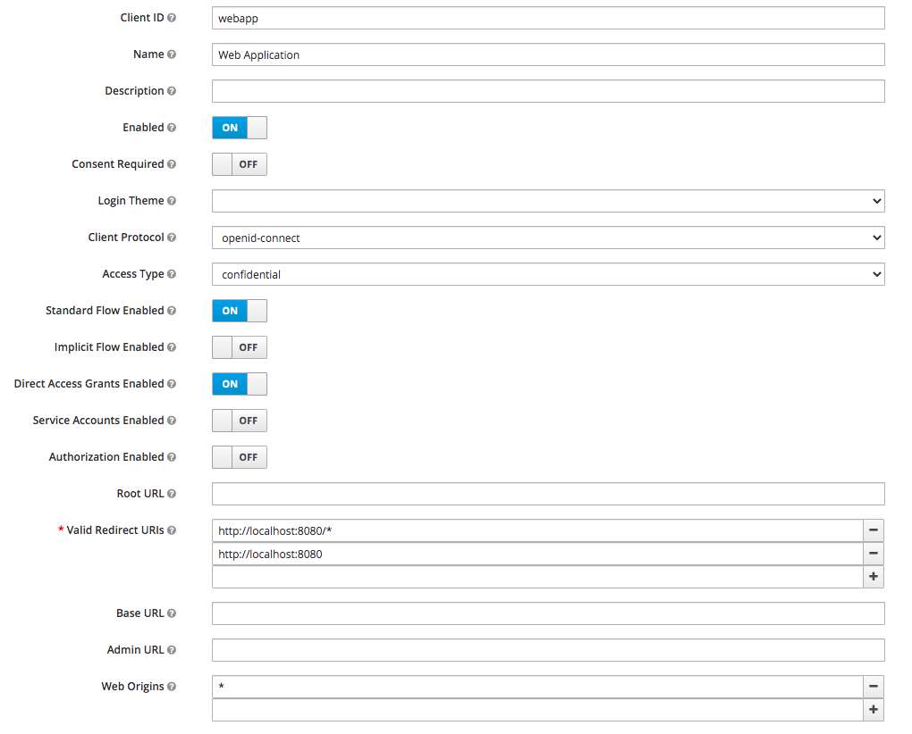

# Swagger UI with Keycloak OIDC on REST API
This project is a toy project to figure out why the Swagger UI gives strange results when using it with a Quarkus backend protected by Keycloak OIDC.

## Building
You need Java 11 installed and Maven 3.6.

```shell
mvn clean verify
```

## Running
To run the application you need to have access to keycloak where you need a client with at least 1 user with one of the roles: admin,edit,view. See `application.properties`. Further you need an .env file with the following keys to specify the link with Keycloak.

```shell
QUARKUS_OIDC_CREDENTIALS_SECRET=
QUARKUS_OIDC_CLIENT_ID=
QUARKUS_OIDC_AUTH_SERVER_URL=
```

Have Keycloak configured as seen in the image.



Note: the * on Web Origins is a bit overkill, + should be fine.

Finally run the application.

```shell
java -jar target/quarkus-app/quarkus-run.jar
```

Note: the `.env` file needs to be in the same directory as you run the `java` command.